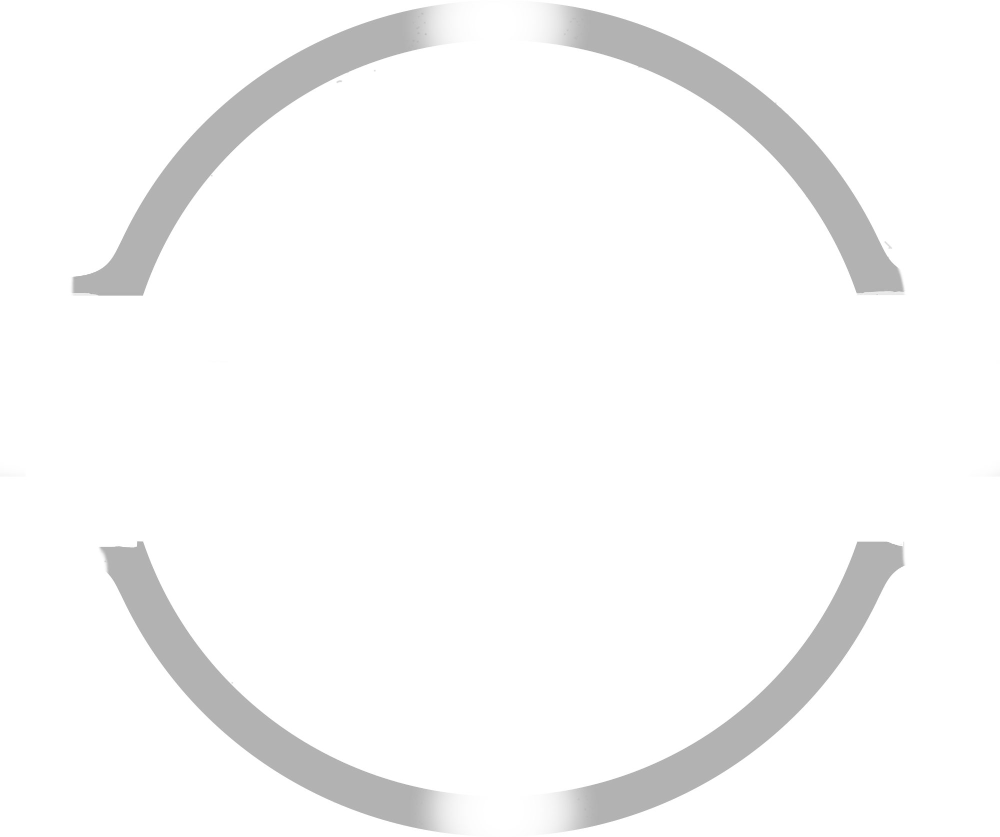

<!-- Improved compatibility of back to top link: See: https://github.com/othneildrew/Best-README-Template/pull/73 -->

<!--
*** Thanks for checking out the Best-README-Template. If you have a suggestion
*** that would make this better, please fork the repo and create a pull request
*** or simply open an issue with the tag "enhancement".
*** Don't forget to give the project a star!
*** Thanks again! Now go create something AMAZING! :D
-->

<!-- PROJECT LOGO -->
 

  

  <h3 align="center">Khodari used cars showroom</h3>

  

Real life project - Web Application
     
    <a href="https://github.com/asanes19/KhodariShowroom"><strong>Explore the docs »</strong></a>
     
    <a href="http://khodari.infinityfreeapp.com/">View Demo</a>
  

<!-- TABLE OF CONTENTS -->

  
Table of Contents

  <ol>
    <li>
      <a href="#about-the-project">About The Project</a>
      <ul>
        <li><a href="#built-with">Built With</a></li>
      </ul>
    </li>
    <li>
      <a href="#getting-started">Getting Started</a>
      <ul>
        <li><a href="#prerequisites">Prerequisites</a></li>
        <li><a href="#installation">Installation</a></li>
      </ul>
    </li>
    <li><a href="#usage">Usage</a></li>
    <li><a href="#roadmap">Roadmap</a></li>
    <li><a href="#contributing">Contributing</a></li>
    <li><a href="#license">License</a></li>
    <li><a href="#contact">Contact</a></li>
    <li><a href="#acknowledgments">Acknowledgments</a></li>
  </ol>

<!-- ABOUT THE PROJECT -->
## About The Project

  <a href="https://github.com/asanes19">
    <video src="https://github.com/asanes19/KhodariShowroom/assets/140919140/0d55a56b-c792-4c35-97f6-ebc90cd84ee0" alt="Logo" width="

  </a>

Welcome to the Falcon Island project! This repository contains information and resources related to our townhouse development. If you're interested in modern and attractive townhouses with stunning views, you're in the right place.

### Built With

# Falcon Island Website README

Welcome to the Falcon Island Website repository! This GitHub project hosts the code and assets for our Falcon Island project landing page. Here's an overview of what you'll find in each section of the website:

## More Information About The Townhouses
In this section, you can find detailed information about the luxurious townhouses available at Falcon Island. Discover the unique features, architectural design, and amenities that make these townhouses a perfect choice for modern living.

## Discover The Most Attractive Views
Experience the breathtaking views that Falcon Island has to offer. In this section, we showcase the stunning vistas and surroundings that residents can enjoy from their townhouses. Get a glimpse of the natural beauty and urban landscapes that define Falcon Island's appeal.

## Masterplan
Explore the masterplan that lays out the community's layout and design. Learn about the arrangement of townhouses, green spaces, communal areas, and the thoughtful planning that fosters a sense of belonging and well-being among Falcon Island residents.

## Video Tour
Immerse yourself in Falcon Island through our captivating video tour. This section provides an engaging visual journey, highlighting the townhouses, common areas, and the overall ambiance of the community. Experience the essence of Falcon Island from the comfort of your screen.

## Floor Plans & 3D Tour
Browse a variety of floor plans to envision your future home on Falcon Island. Our interactive 3D tours offer an immersive virtual experience, allowing you to navigate through different townhouse layouts and get a feel for the space and design.

## Don't Hesitate To Contact Us
Got questions or ready to explore further? Reach out to our dedicated team for assistance. Whether you're interested in scheduling a site visit, obtaining more details about the townhouses, or have general inquiries, this section provides the necessary contact information to get in touch.

We invite you to explore the various sections of our Falcon Island website to get a comprehensive understanding of this exciting project. For the latest updates and more detailed information.

---
 
 

<h3> 🙋‍♀️ Let's Connect </h3>

