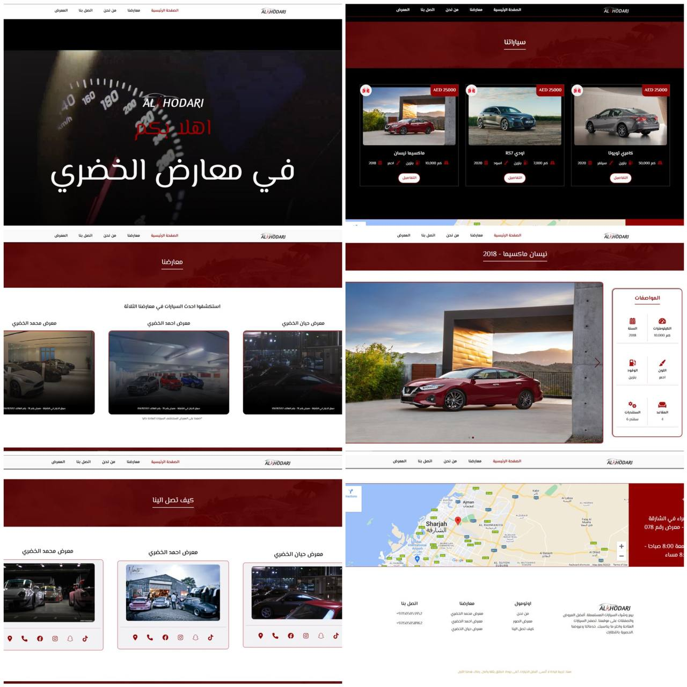
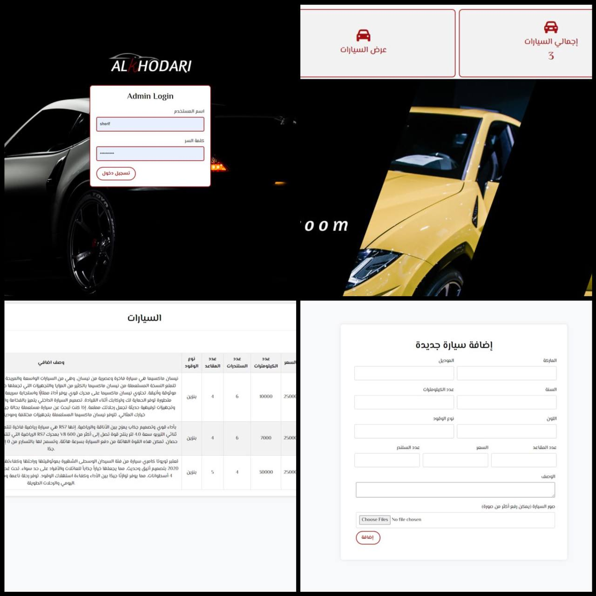

<!-- Improved compatibility of back to top link: See: https://github.com/othneildrew/Best-README-Template/pull/73 -->

<!--
*** Thanks for checking out the Best-README-Template. If you have a suggestion
*** that would make this better, please fork the repo and create a pull request
*** or simply open an issue with the tag "enhancement".
*** Don't forget to give the project a star!
*** Thanks again! Now go create something AMAZING! :D
-->

<!-- PROJECT LOGO -->
 

  

  <h3 align="center">Khodari used cars showroom</h3>

  

Real life project - Web Application
     
    <a href="https://github.com/asanes19/KhodariShowroom"><strong>Explore the docs »</strong></a>
     
    <a href="http://khodari.infinityfreeapp.com/">View Demo</a>
    <a href="https://dreamy-fox-1e6c6c.netlify.app/">Video Demo</a>
  

<!-- ABOUT THE PROJECT -->
## About The Project

  

The Khodari Used Cars Showroom Web App provides users with easy access to information about three showroom branches: Nohamed, Ahmed, and Haeean. Users can explore car inventory, view details about available cars, and connect with showroom locations and social media. The application also offers an admin panel for staff to manage inventory, dealers, and users, ensuring efficient content management. With a user-friendly interface and comprehensive features, the app bridges the gap between potential buyers and the Khodari showroom, enhancing the car browsing experience.

### Built With

  
  

## Welcome to the Khodari Used Cars Showroom Web App README

Welcome to the Khodari Used Cars Showroom Web App repository! This GitHub project hosts the code and assets for our innovative web application designed exclusively for Khodari Used Cars Showroom. Here's a comprehensive overview of what our web app offers:

## Client Panel: Explore Our Showrooms
Our web app offers users a seamless gateway to all three branches of Khodari Used Cars Showroom: Nohamed, Ahmed, and Haeean. Users can effortlessly access detailed information about each showroom, including contact numbers, addresses, social media links, and a comprehensive listing of available cars. From luxurious sedans to rugged SUVs, our web app provides an extensive view of the diverse range of vehicles we offer.

## Interactive Maps: Locate with Ease
Discover the precise locations of our showrooms using interactive maps. Seamlessly integrated with each showroom's details, these maps provide step-by-step directions, making it a breeze to find the nearest showroom. Whether you're exploring on foot or by car, our interactive maps ensure you never miss a turn.

## Admin Panel: Streamlined Management
Our robust admin panel empowers staff members with the ability to enhance and manage the web app's content. Add new cars to the inventory, showcase special deals, manage dealers' information, and efficiently oversee user accounts. Our intuitive interface simplifies the process, allowing staff to focus on delivering the best experience to our users.

## Responsive Design: Anytime, Anywhere
Experience our web app seamlessly across various devices. Whether you're browsing on a desktop, tablet, or mobile phone, our responsive design ensures optimal performance and usability. Browse through our inventory while on the go, and easily reach out to our showrooms for further inquiries.

## Feedback and Support: Reach Out
Have questions or feedback? Our dedicated support team is here to help. Utilize the provided contact information to connect with us directly. We value your input and strive to provide exceptional customer service at every step.

We invite you to explore the Khodari Used Cars Showroom Web App to uncover a world of automotive excellence. For the latest updates and to dive deeper into our offerings, please visit our website. Experience the convenience, variety, and quality that define Khodari's commitment to delivering exceptional used cars and outstanding service.

 

<h3> 🙋‍♀️ Let's Connect </h3>

